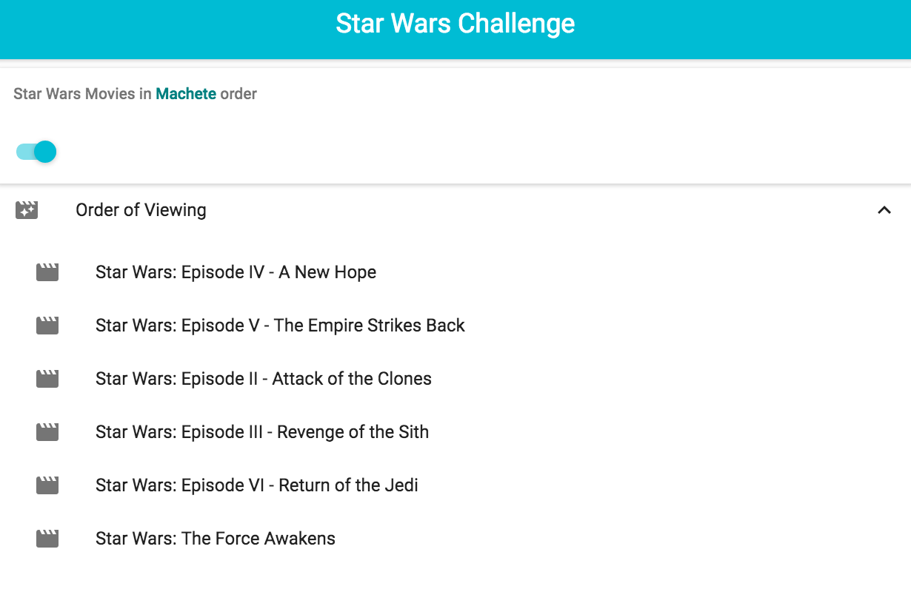

# Install instructions

### First get meteor
```curl https://install.meteor.com/ | sh```

https://www.meteor.com/install

* Then, clone this repo.
* Finally, run ```npm start``` and check localhost:3000


